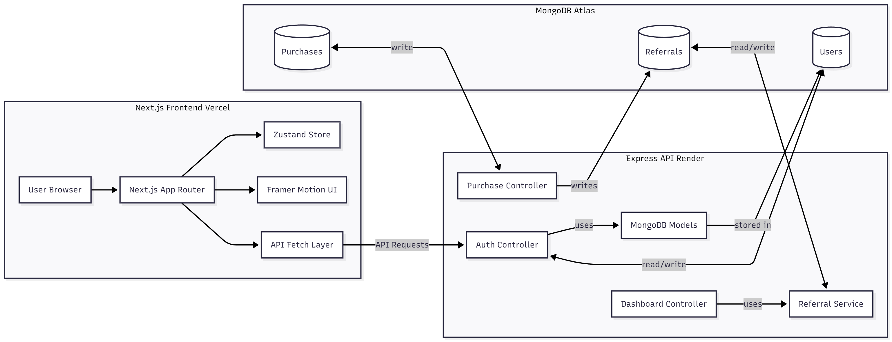
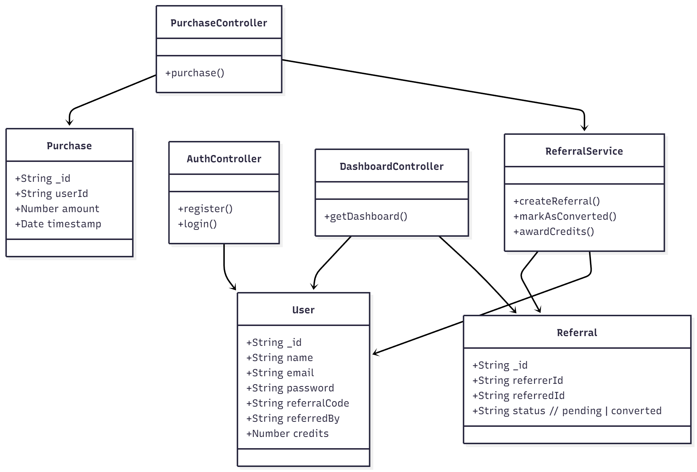
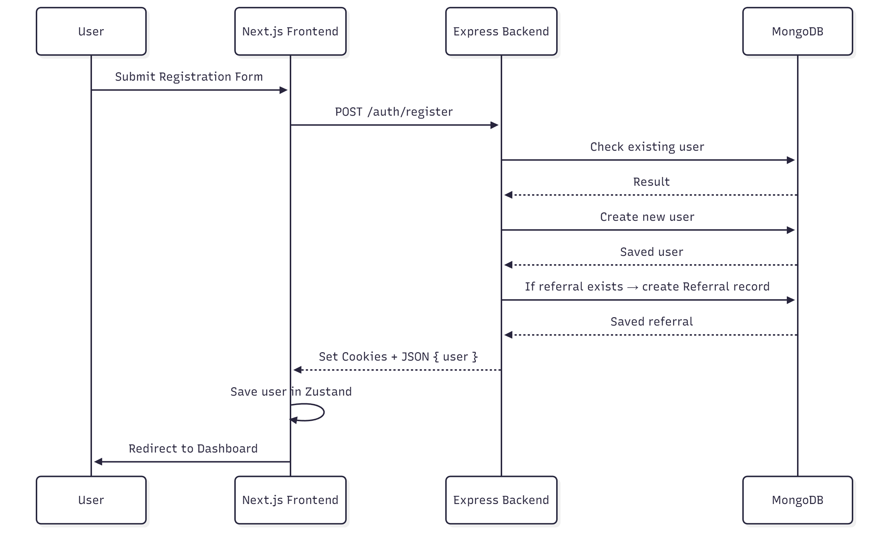
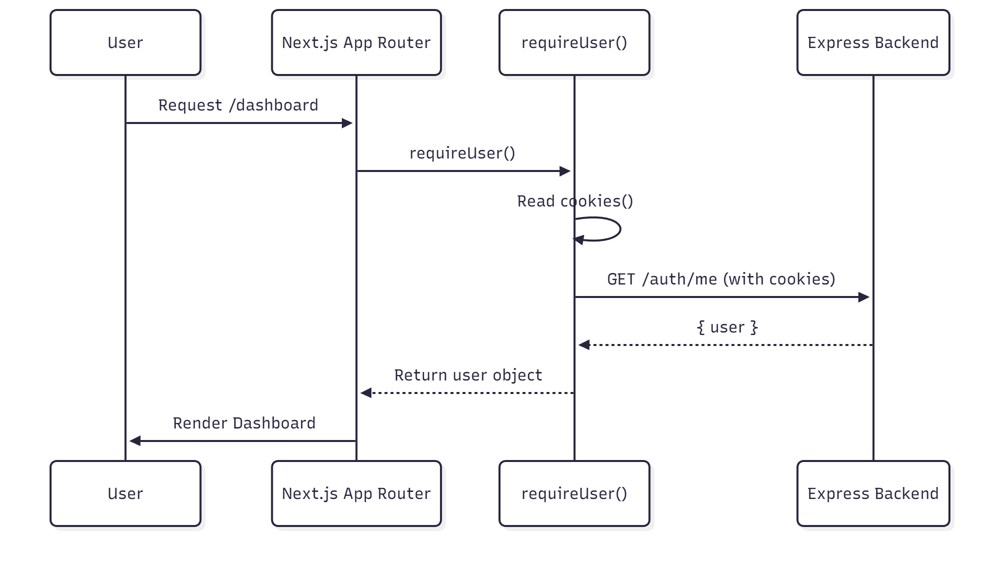

# FileSure Referral System

A full-stack referral rewards system built with modern web technologies.

This system implements secure authentication, referral tracking, and a real-time dashboard — all wrapped in a clean, animated UI.

---

## Tech Stack

### **Backend**
- Node.js + Express  
- MongoDB (Mongoose)  
- JWT Authentication (Access + Refresh tokens)  
- Secure HTTP-only Cookies  
- Referral & Purchase logic  
- CORS configured for cross-domain cookies  
- Deployed on **Render**

### **Frontend**
- Next.js 16 (App Router)  
- Zustand for state management  
- Tailwind CSS  
- Framer Motion animations  
- Toast notifications  
- Deployed on **Vercel**

---

## Features

### ✅ Authentication
- Register with optional referral code  
- Login via secure cookies  
- Access + Refresh token flow  
- Automatic session validation

### ✅ Referral System
- Auto-generated referral codes  
- Copyable referral links  
- Track referred users  
- Reward credits on first purchase  
- Pending + converted referral tracking

### ✅ Dashboard
- Total referred users  
- Converted referrals  
- Pending referrals  
- Total credits  
- Animated referral table  
- Simulated purchase button  

### ✅ UI Enhancements
- Fully responsive UI  
- Framer Motion animations  
- Toast messages for all actions  

---

# Project Structure

```
filesure-assignment/
│
├── backend/
│ ├── src/
│ │ ├── controllers/
│ │ ├── middlewares/
│ │ ├── models/
│ │ ├── routes/
│ │ ├── services/
│ │ ├── utils/
│ │ └── index.ts
│ ├── package.json
│ ├── tsconfig.json
│ └── .env (excluded)
│
└── frontend/
├── app/
├── lib/
├── store/
├── components/
├── package.json
├── next.config.js
└── .env.local (excluded)
```


---

# Environment Variables

## Backend (`.env` on Render)

| Key | Description |
|-----|-------------|
| `CLIENT_URL` | Vercel frontend domain |
| `MONGO_URI` | MongoDB connection string |
| `JWT_ACCESS_SECRET` | Access token secret |
| `JWT_REFRESH_SECRET` | Refresh token secret |

---

## Frontend (`.env.local` on Vercel)

| Key | Description |
|-----|-------------|
| `API_URL` | Backend API URL |
| `NEXT_PUBLIC_API_URL` | Same as above, exposed to browser |

---

# Setup

### **STEP 1 — Clone Repo**
```sh
git clone https://github.com/Ashish-Bakshi/filesure-assignment.git
cd filesure-assignment
```
### **STEP 2 — Move To Backend and install dependencies**
```sh
cd backend
npm install
```

### **STEP 3 - Create .env**
```sh
CLIENT_URL=http://localhost:3000
MONGO_URI=your_mongo_uri
JWT_ACCESS_SECRET=your_access_secret
JWT_REFRESH_SECRET=your_refresh_secret
```

### **STEP 4 - Start backend**
```sh
npm run dev
```
## Frontend Setup

### **STEP 5 - Move to frontend and install dependencies**
```sh
cd frontend 
npm install
```
### **STEP 6 - Add .env.local**
```sh
API_URL=http://localhost:5000/api
NEXT_PUBLIC_API_URL=http://localhost:5000/api
```
### **STEP 7 - start frontend**
```sh
npm run dev
```

# Security Notes

Cookies are HTTP-only and cannot be accessed by JavaScript

SameSite=None + secure: true required for cross-domain auth

Refresh token rotates session automatically

# 1. System Architecture


# 2. Backend Class Diagram


# 3. Registration Flow (Sequence Diagram)


# 4. Login & Access Control (Sequence Diagram)


# NOTE 
- There is some issue related to cookies in produciton for this assignment

- it works properly locally as instructed in the assignment docs

- kindly review the code as there is only some issue with cookie which im not able to solve right now else everything every functionality is running.